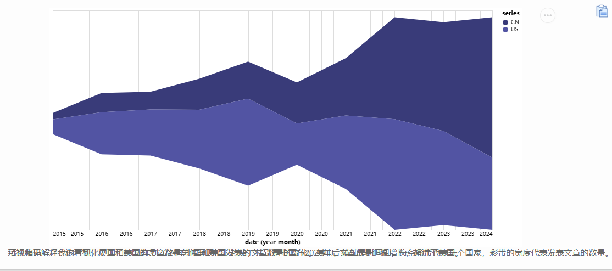
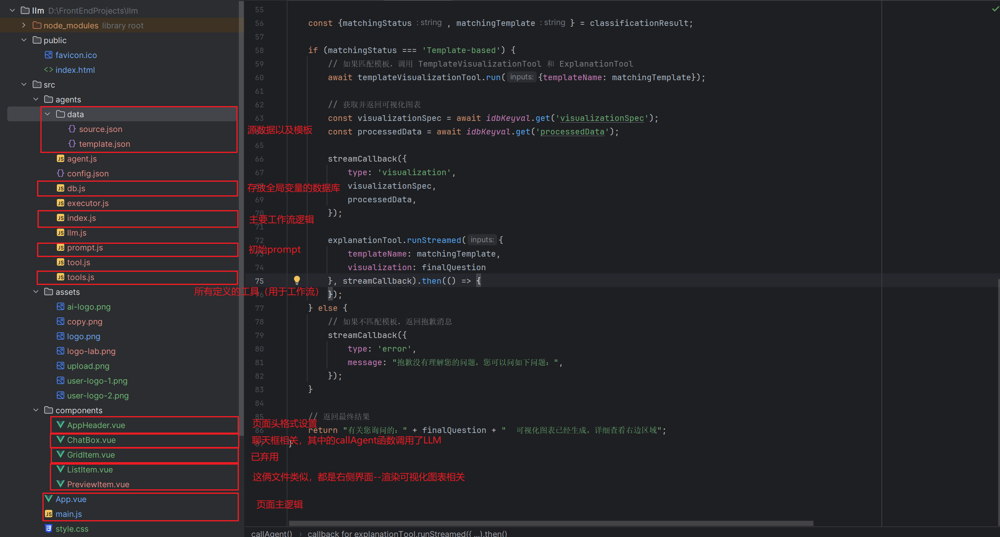

# AI文献可视化分析助手

### 项目启动

* ##### 依赖库下载；

  ```
  npm install
  ```

  

* ##### 项目编译启动（hot-reloads的方式）；

  ```
  npm run serve
  ```

  

* ##### 浏览器中打开网页；

* ##### 退出项目按Ctrl+C


### 项目结构

* ##### agents -- 存放与大模型相关的各种逻辑

* ##### assets -- 资源文件

* ##### components -- Vue组件，如果可以的话注意两点：

  * **App.vue** 中的 **updateListItems函数** 将每个图表的数据存到了数据库中，调用会有点慢，尝试改成局部变量实现，但大规模的数据好像会有些问题；

  * **ListItem.vue** 在显示每个图表的解释时直接将div的text属性给定会重叠显示，如下：

  

  

  目前使用的方式是手动分行，但这个实现很简易，会存在每行宽度不一致的情况，尝试修改分行函数或者使用其它方式解决显示问题，如下：
  
  

#### 项目文件的详细介绍参照下图：



# 更新日志

## [1.1.0] - 2024-08-27

### 新增功能
- 新增文件夹模式模板库的导入功能
- 新增模板测试功能